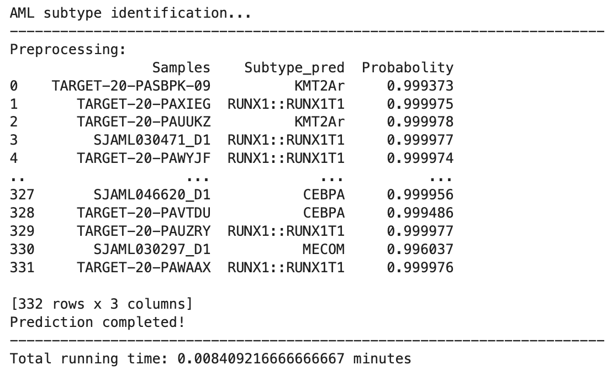

# AttentionAML: an <ins>Attention</ins>-based MLP Model for Identifying <ins>A</ins>cute <ins>M</ins>yeloid <ins>L</ins>eukemia Subtypes
**AttentionAML** (an **Attention**-Based MLP Model for Identifying **A**cute **M**yeloid **L**eukemia Subtypes), an accurate and effective model for AML subtype identification.

## Flowchart of AttentionAML


## Installation
1. Clone the AttentionAML git repository
```bash
git clone https://github.com/wan-mlab/AttentionAML.git
```
2. Navigate to the directory of AttentionAML package
```bash
cd /your path/AttentionAML
pip install .
```
## Tutorial
### Jupyter notebook
1. Modify the System Path and import module
```bash
import sys; sys.path.append('AttentionAML')
from AttentionAML import AttentionAML
```
2. unzip and read the test file
```bash
test = pd.read_csv('TPM_test.csv', index_col=0)
```
3. AML subtype prediction
```bash
AttentionAML.Predict(Exp = test, exp_type = 'TPM')
```
4. Example Outputs



The prediction results will be stored and exported to the Prediction_results.csv

## Authors
Lusheng Li, Shibiao Wan

## Publication
AttentionAML: An Attention-based Deep Learning Framework for Accurate Molecular Categorization of Acute Myeloid Leukemia
Lusheng Li, Joseph D. Khoury, Jieqiong Wang, Shibiao Wan
bioRxiv 2025.05.20.655179v1; doi: https://doi.org/10.1101/2025.05.20.655179

## License 

[](https://www.gnu.org/licenses/gpl-3.0)

GNU GENERAL PUBLIC LICENSE  
Version 3, 29 June 2007

This program is free software: you can redistribute it and/or modify
it under the terms of the GNU General Public License as published by
the Free Software Foundation, either version 3 of the License, or
(at your option) any later version.

This program is distributed in the hope that it will be useful,
but WITHOUT ANY WARRANTY; without even the implied warranty of
MERCHANTABILITY or FITNESS FOR A PARTICULAR PURPOSE.  See the
GNU General Public License for more details.

You should have received a copy of the GNU General Public License
along with this program.  If not, see <https://www.gnu.org/licenses/>.
