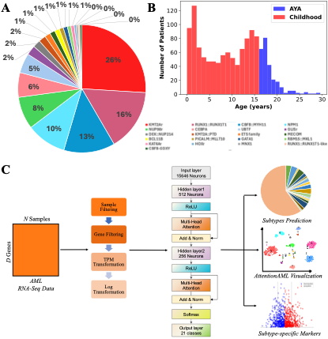

# AttentionAML: an Attention-based MLP Model for Identifying Acute Myeloid Leukemia Subtypes
**AttentionAML** (an **Attention**-Based MLP Model for Identifying **A**cute **M**yeloid **L**eukemia Subtypes), an accurate and effective model for AML subtype identification based on transcriptomic profiling only.

## Flowchart of AttentionAML


## Installation
1. Clone the AttentionAML git repository
```bash
git clone https://github.com/wan-mlab/AttentionAML.git
```
2. Navigate to the directory of AttentionAML package
```bash
cd /your path/AttentionAML
pip install .
```
## Tutorial
### Jupyter notebook
1. Modify the System Path and import module
```bash
import sys; sys.path.append('AttentionAML')
from AttentionAML import AttentionAML
```
2. unzip and read the test file
```bash
test = pd.read_csv('TPM_test.csv', index_col=0)
```
3. AML subtype prediction
```bash
AttentionAML.Predict(Exp = test, exp_type = 'TPM')
```
## Authors
Lusheng Li, Shibiao Wan
